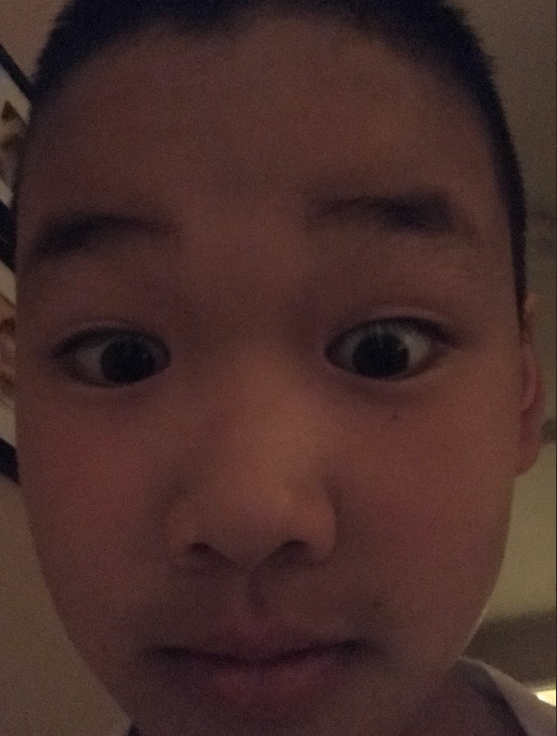
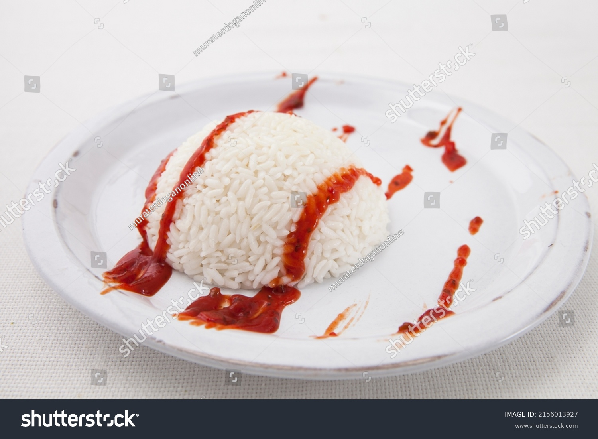

## **About Me**

<!--  -->
 

Hello I'm Matthew Wakayama, and I am 15 years old. I go to [Del Norte High School](https://delnorte.powayusd.com/). I am currently taking Honors Humanities, Ap Chemistry, Ap Computer Science, Ap Calculus, and Spanish. If you want to watch a quality espanol video:

[billy espanol video](https://www.youtube.com/watch?v=dBTGxLc-lv0)

 Outside of school I swim for a club called [Pacific Swim](https://pacificswim.com/). 

<!--  -->